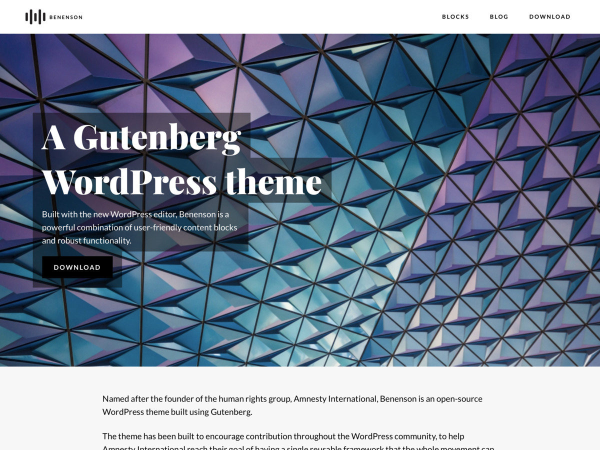

# Benenson

Benenson is a WordPress theme 

# Features

# Requirements
- [WordPress](https://wordpress.org) >= 5.0
- [PHP](https://php.net) >=  5.6
- [Node](https://nodejs.org) >= 8.9.* (_for development_)
- [Yarn](https://yarnpkg.com) (_for development_)

## Third-party Resources:
Benenson bundles the following third-party resources:

- [Playfair Display](https://fonts.google.com/specimen/Playfair+Display) & [Lato](https://fonts.google.com/specimen/Lato) fonts served from [Google Fonts](https://fonts.google.com/)
- [Feather Icons](https://feathericons.com/)
- [IcoMoon Free Icons](https://github.com/Keyamoon/IcoMoon-Free)

## Code of Conduct
In the interest of fostering an open and welcoming environment, we are using the [Contributor Covenant Code of Conduct](CODE_OF_CONDUCT.md).

## Theme Development
Please refer to the [Github Wiki](https://github.com/bigbitecreative/benenson/wiki) for development details for Benenson.

## Changelog
Please refer to the [Releases page](https://github.com/bigbitecreative/benenson/releases) for the changelog.
